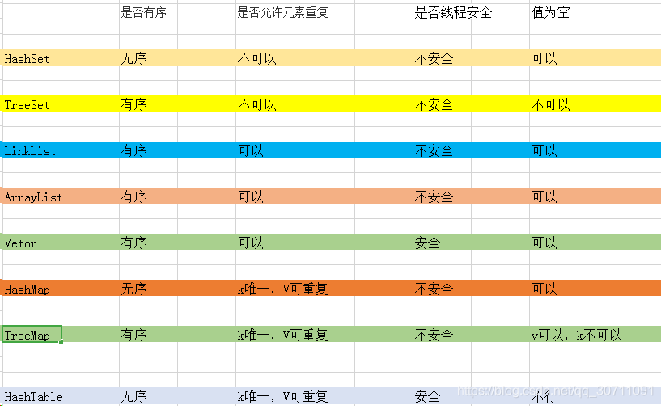
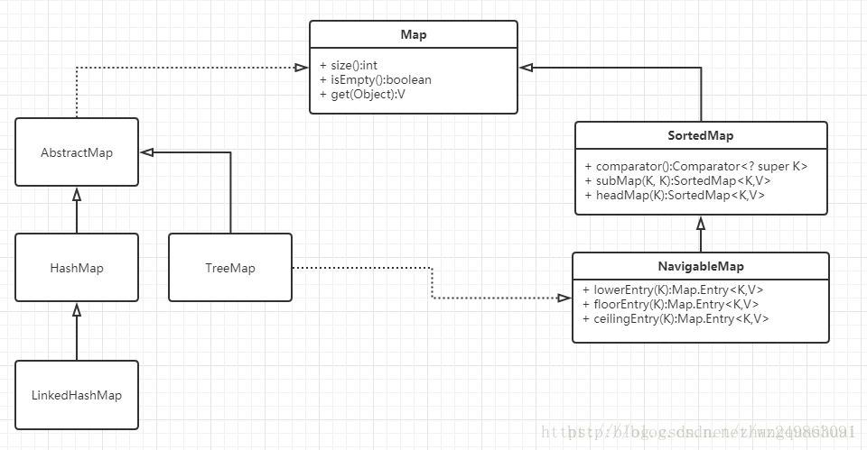
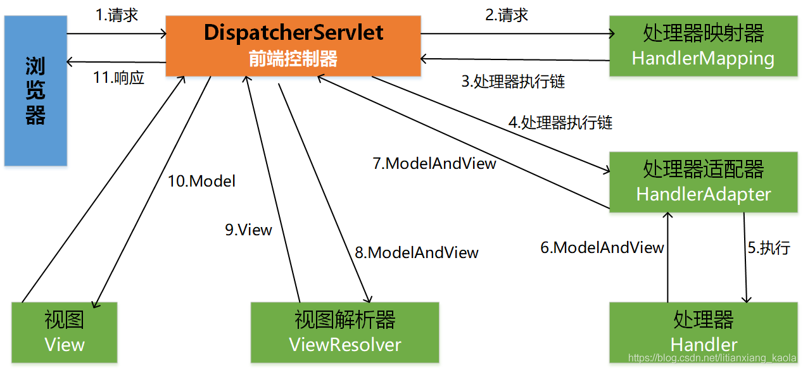

{{site.label1}} <a href="https://github.com/Math-Pi" target="\_blank">Jax</a> {{site.label2}}

# Java 的学习笔记

## 1.public static void main(String[] args) 是什么意思
这是java程序的入口地址,java虚拟机运行程序的时候首先找的就是main方法

- **public**:表示的这个程序的访问权限,表示的是任何的场合可以被引用,这样java虚拟机就可以找到main()方法,从而来运行javac程序

- **static**:表明方法是静态的,不依赖类的对象的,是属于类的,在类加载的时候main()方法也随着加载到内存中去

- **void**:main()方法是不需要返回值的
- **main**:约定俗成,规定的
- **String**[] args:从控制台接收参数

## 2.数组不同类型的默认值

```
char[] c=new char[3];	//c[0]=空字符
int[] i=new int[3];		//i[0]=0
String[] s=new String[3];//s[0]=null
```

## 3.“互斥”锁机制

- 当线程A获得了一个对象的互斥锁后，线程B若也想获得该对象的互斥锁，就必须等待线程A完成规定的操作并释放出互斥锁后，才能获得该对象的互斥锁，并执行线程B的操作。

## 4.Java多线程实现 

- 继承**Thread**类，重写run方法（其实Thread类本身也实现了Runnable接口）

- 实现**Runnable**接口，重写run方法

- 实现**Callable**接口，重写call方法（有返回值）

## 5.同步和异步的区别 

同步，是所有的操作都做完，才返回给用户结果。即写完数据库之后，再响应用户，用户体验不好。
异步，不用等所有操作都做完，就相应用户请求。即先响应用户请求，然后慢慢去写数据库，用户体验较好。

## 6.集合类

- List , Set, Map都是接口，前两个继承至Collection接口，Map为独立接口
- Set下有HashSet，LinkedHashSet，TreeSet
- List下有ArrayList，Vector，LinkedList
- Map下有Hashtable，LinkedHashMap，HashMap，TreeMap
- Collection接口下还有个Queue接口，有PriorityQueue类
- Vector和Hashtable线程安全


### Connection接口:

— **List 有序,可重复**

- ArrayList
  **优点:** 底层数据结构是数组，查询快，增删慢。
  **缺点:** 线程不安全，效率高
- Vector
  **优点:** 底层数据结构是数组，查询快，增删慢。
  **缺点:** 线程安全，效率低
- LinkedList
  **优点:** 底层数据结构是链表，查询慢，增删快。
  **缺点:** 线程不安全，效率高

—**Set 无序,唯一**

- HashSet
  底层数据结构是哈希表。(无序,唯一)
  如何来保证元素唯一性?
  1.依赖两个方法：hashCode()和equals()
- LinkedHashSet
  底层数据结构是链表和哈希表。(FIFO插入有序,唯一)
  1.由链表保证元素有序
  2.由哈希表保证元素唯一
- TreeSet
  底层数据结构是红黑树。(唯一，有序)
  \1. 如何保证元素排序的呢?
  自然排序
  比较器排序
  2.如何保证元素唯一性的呢?
  根据比较的返回值是否是0来决定

### Map接口:


Map接口有三个比较重要的实现类，分别是HashMap、TreeMap和HashTable。

- TreeMap是有序的，HashMap和HashTable是无序的。
- Hashtable的方法是同步的，HashMap的方法不是同步的。这是两者最主要的区别。

## 7.线程几个方法的比较

- **等待阻塞**：运行(running)的线程执行o.wait()方法，JVM会把该线程放入等待队列(waitting queue)中。
- **同步阻塞**：运行(running)的线程在获取对象的同步锁时，若该同步锁被别的线程占用，则JVM会把该线程放入锁池(lock pool)中。
- **其他阻塞**：运行(running)的线程执行Thread.sleep(long ms)或t.join()方法，或者发出了I/O请求时，JVM会把该线程置为阻塞状态。当sleep()状态超时、join()等待线程终止或者超时、或者I/O处理完毕时，线程重新转入可运行(runnable)状态。

1. **Thread.sleep(long millis)**，一定是当前线程调用此方法，当前线程进入阻塞，但不释放对象锁，millis后线程自动苏醒进入可运行状态。作用：给其它线程执行机会的最佳方式。
2. **Thread.yield()**，一定是当前线程调用此方法，当前线程放弃获取的cpu时间片，由运行状态变会可运行状态，让OS再次选择线程。作用：让相同优先级的线程轮流执行，但并不保证一定会轮流执行。实际中无法保证yield()达到让步目的，因为让步的线程还有可能被线程调度程序再次选中。Thread.yield()不会导致阻塞。
3. **t.join()/t.join(long millis)**，当前线程里调用其它线程1的join方法，当前线程阻塞，但不释放对象锁，直到线程1执行完毕或者millis时间到，当前线程进入可运行状态。
4. **obj.wait()**，当前线程调用对象的wait()方法，当前线程释放对象锁，进入等待队列。依靠notify()/notifyAll()唤醒或者wait(long timeout)timeout时间到自动唤醒。
5. **obj.notify()**唤醒在此对象监视器上等待的单个线程，选择是任意性的。notifyAll()唤醒在此对象监视器上等待的所有线程。

## 8.抽象类和接口的区别有哪些

- 抽象类要被子类继承，接口要被类实现。
- 接口只能做方法声明，抽象类中可以作方法声明，也可以做方法实现。
- 接口里定义的变量只能是公共的静态的常量，抽象类中的变量是普通变量。
- 接口是设计的结果，抽象类是重构的结果。
- 抽象类和接口都是用来抽象具体对象的，但是接口的抽象级别最高。
- 抽象类可以有具体的方法和属性，接口只能有抽象方法和不可变常量。
- 抽象类主要用来抽象类别，接口主要用来抽象功能。
- 一个类只能继承一个抽象类，而一个类却可以实现多个接口。

## 9.Runnable和Callable的区别

### 相同点

1、两者都是接口；（废话）
2、两者都可用来编写多线程程序；
3、两者都需要调用Thread.start()启动线程；

### 不同点

1、两者最大的不同点是：实现Callable接口的任务线程能返回执行结果；而实现Runnable接口的任务线程不能返回结果；
2、Callable接口的call()方法允许抛出异常；而Runnable接口的run()方法的异常只能在内部消化，不能继续上抛；

```java
//继承Thread类
class MyThread extends Thread{
	public void run(){
		System.out.println("继承Thread类！");
	}
}
//实现Runnable接口
class MyRunnable implements Runnable {
	public void run(){
		System.out.println("实现Runnable接口！");
	}
}
//实现Runnable接口
import java.util.concurrent.*;
class MyCallable implements Callable<Integer> {
	public Integer call(){
		System.out.println("实现Callable接口！");
		return 1;
	}
}
//Test类
import java.util.concurrent.*;
public class Test{
	public static void main(String[] args){
		//继承Thread类
		Thread t1 = new MyThread();
		t1.start();
		//实现Runnable接口
		Runnable r = new MyRunnable();
		Thread t2 = new Thread(r);
		t2.start();
		//实现Callable接口
		Callable<Integer> myCallable = new MyCallable();
		FutureTask<Integer> futureTask = new FutureTask<Integer>(myCallable);
		Thread t3 = new Thread(futureTask);
		t3.start();
	}
}
```


### 注意点

**Callable接口支持返回执行结果，此时需要调用FutureTask.get()方法实现，此方法会阻塞主线程直到获取‘将来’结果；当不调用此方法时，主线程不会阻塞！**

## 10.阻塞

- **BIO（同步阻塞）**
- **NIO（同步非阻塞）**
- **AIO（异步非阻塞）**
  - 缓冲区buffer
  - 通道channel
  - 多路复用器 Selector
  - NIO服务端
  - NIO客户端

| 类型 |                            烧开水                            |
| :--: | :----------------------------------------------------------: |
| BIO  |      一直监测着某个水壶，该水壶烧开水后再监测下一个水壶      |
| NIO  | 每隔一段时间就看看所有水壶的状态，哪个水壶烧开水就去处理哪个水壶 |
| AIO  | 不用监测水壶，每个水壶烧开水后都会主动通知线程说：“我的水烧开了，来处理我吧” |

## 11.封装继承多态

- 封装：指把变量和方法包装在一个类内，以限定成员的访问，从而达到保护数据的一种技术。

- 继承：一个对象直接使用另一个对象的属性和方法。

- 多态：指一个程序中同名的多个方法共存的情况，即一个对外接口，多个内在实现的方法。

  - 继承
  - 重写
  - 父类引用指向子类对象（引用还是指向父类）

  ~~~java
  Parent p = new Child();
  ~~~

  

## 12.什么是MVC？使用MVC的好处是什么？

MVC模式的目的就是实现Web系统的职能分工。

### SpringMVC的概述

- 模型（Model）：实现系统中的业务逻辑，通常可以用JavaBean或EJB来实现。
- 视图（View）：用于与用户的交互，通常用JSP来实现。
- 控制器（Controller）：Model与View之间沟通的桥梁，它可以分派用户的请求并选择恰当的视图以用于显示，同时它也可以解释用户的输入并将它们映射为模型层可执行的操作。

### SpringMVC的核心架构



### SpringMVC的工作流程

（1）首先浏览器发送请求——>DispatcherServlet，前端控制器收到请求后自己不进行处理，而是委托给其他的解析器进行处理，作为统一访问点，进行全局的流程控制；

（2）DispatcherServlet——>HandlerMapping，处理器映射器将会把请求映射为HandlerExecutionChain对象（包含一个Handler处理器对象、多个HandlerInterceptor拦截器）对象；

（3）DispatcherServlet——>HandlerAdapter，处理器适配器将会把处理器包装为适配器，从而支持多种类型的处理器，即适配器设计模式的应用，从而很容易支持很多类型的处理器；

（4）HandlerAdapter——>调用处理器相应功能处理方法，并返回一个ModelAndView对象（包含模型数据、逻辑视图名）；

（5）ModelAndView对象（Model部分是业务对象返回的模型数据，View部分为逻辑视图名）——> ViewResolver， 视图解析器将把逻辑视图名解析为具体的View；

（6）View——>渲染，View会根据传进来的Model模型数据进行渲染，此处的Model实际是一个Map数据结构；

（7）返回控制权给DispatcherServlet，由DispatcherServlet返回响应给用户，到此一个流程结束。

### SpringMVC的好处

- **低耦合性**：视图层和业务层分离，这样就允许更改视图层代码而不用重新编译模型和控制器代码，同样，一个应用的业务流程或者业务规则的改变只需要改动MVC的模型层即可。因为模型与控制器和视图相分离，所以很容易改变应用程序的数据层和业务规则。
- **较低的生命周期成本**：MVC使降低开发和维护用户接口的技术含量成为可能。
- **快速的部署**：使用MVC模式使开发时间得到相当大的缩减，它使程序员（Java开发人员）集中精力于业务逻辑，界面程序员（HTML和JSP开发人员）集中精力于表现形式上。
- **可维护性**：分离视图层和业务逻辑层也使得WEB应用更易于维护和修改。

## 13.如何解决POST请求中文乱码问题，GET的又如何处理呢？

**（1）解决post请求乱码问题：**

在web.xml中配置一个CharacterEncodingFilter过滤器，设置成utf-8；

```xml
<filter>
    <filter-name>CharacterEncodingFilter</filter-name>
    <filter-class>org.springframework.web.filter.CharacterEncodingFilter</filter-class>
    <init-param>
        <param-name>encoding</param-name>
        <param-value>utf-8</param-value>
    </init-param>
</filter>    
<filter-mapping>
    <filter-name>CharacterEncodingFilter</filter-name>
    <url-pattern>/*</url-pattern>
</filter-mapping>
```

**（2）get请求中文参数出现乱码解决方法有两个：**

①修改tomcat配置文件添加编码与工程编码一致，如下：

```xml
<ConnectorURIEncoding="utf-8" connectionTimeout="20000" port="8080" protocol="HTTP/1.1" redirectPort="8443"/>
```

 ②另外一种方法对参数进行重新编码：

```java
String userName = new String(request.getParamter("userName").getBytes("ISO8859-1"),"utf-8");
```

ISO8859-1是tomcat默认编码，需要将tomcat编码后的内容按utf-8编码。

## 14.hashCode()

> *hashCode* 的存在主要是用于查找的快捷性，如 *Hashtable*，*HashMap*，*HashSet* 等，*hashCode* 是用来在散列存储结构中确定对象的存储地址的。

+ 两个对象相同， *equals()* 方法一定返回 *true*，并且这两个对象的 *hashCode* 一定相同。

+ 两个对象的 *hashCode* 相同，并不一定表示两个对象相同，即 *equals()* 不一定为 *true*，只能够说明这两个对象在同一个散列存储结构中。

如果对象的 *equals()* 被重写，那么对象的 *hashCode()* 也尽量重写。

```java
String str1 = "通话";
String str2 = "重地";
System. out. println(String. format("str1：%d | str2：%d", str1. hashCode(),str2. hashCode()));
System. out. println(str1. equals(str2));
//运行结果
str1：1179395 | str2：1179395
false
```


## 15.("").equals(str)与str.equals("")的区别

- **("").equals(str)在str为null的时候返回false**
- **str.equals("")在str为null时会抛空指针异常.**

## 16.String s = new String("abc")创建了几个String对象?

- 2个.一个是字符串字面常数,在字符串常量池中;另一个是new出来的字符串对象,在堆中.

### 16.1 请问s1`==`s3是true还是false，s1`==`s4是false还是true?s1`==`s5呢？

```java
   String s1 = "abc";
   String s2 = "a";
   String s3 = s2 + "bc";
   String s4 = "a" + "bc";
   String s5 = s3.intern();
```

s1`==`s3返回false,s1`==`s4返回true,s1`==`s5返回true.

“abc"这个字符串常量值会直接方法字符串常量池中,s1是对其的引用.**由于s2是个变量,编译器在编译期间无法确定该变量后续会不会改**,因此无法直接将s3的值在编译器计算出来,因此s3是堆中"abc"的引用.因此s1!=s3.对于s4而言,其赋值号右边是常量表达式,因此可以在编译阶段直接被优化为"abc”,由于"abc"已经在字符串常量池中存在,因此s4是对其的引用,此时也就意味s1和s4引用了常量池中的同一个"abc".所以s1`==`s4.String中的`intern()`会首先从字符串常量池中检索是否已经存在字面值为"abc"的对象,如果不存在则先将其添加到字符串常量池中,否则直接返回已存在字符串常量的引用.此处由于"abc"已经存在字符串常量池中了,因此s5和s1引用的是同一个字符串常量.

### 16.2 以下代码中,s5`==`s2返回值是什么?

```java
String s1="ab";
String s2="a"+"b";
String s3="a";
String s4="b";
String s5=s3+s4;
```

返回false.在编译过程中,编译器会将s2直接优化为"ab",将其放置在常量池当中;而s5则是被创建在堆区,相当于s5=new String(“ab”);

### 16.3 你对String对象的intern()熟悉么?

Stirng中的`intern()`是个Native方法,它会**首先从常量池中查找是否存在该常量值的字符串,若不存在则先在常量池中创建,否则直接返回常量池已经存在的字符串的引用**. 比如

```java
 String s1="aa";
 String s2=s1.intern();
 System.out.print(s1==s2);
```

上述代码将返回true.因为在"aa"会在编译阶段确定下来,并放置字符串常量池中,因此最终s1和s2引用的是同一个字符串常量对象.

## 17.String,StringBuffer和StringBuilder区别?

- String是字符串常量,final修饰;
- StringBuffer字符串变量(线程安全);
- StringBuilder 字符串变量(线程不安全).
- 此外StringBuilder和StringBuffer实现原理一样,都是基于数组扩容来实现的.

### 17.1 String和StringBuffer的区别?

String和StringBuffer主要区别是性能:String是不可变对象,每次对String类型进行操作都等同于产生了一个新的String对象,然后指向新的String对象.所以**尽量不要对String进行大量的拼接操作**,否则会产生很多临时对象,导致GC开始工作,影响系统性能.

**StringBuffer是对象本身操作**,而不是产生新的对象,因此在有大量拼接的情况下,我们建议使用StringBuffer(线程安全).

需要注意现在JVM会对String拼接做一定的优化,比如

```java
String s="This is only "+ "simple" +"test";
```

以上代码在编译阶段会直接被优化成会`String s=“This is only simple test”.

### 17.2 StringBuffer和StringBuilder的区别？

StringBuffer和StringBuilder的实现原理一样,其父类都是AbstractStringBuilder.StringBuffer是线程安全的,StringBuilder是JDK 1.5新增的,其功能和StringBuffer类似,但是非线程安全.因此,在没有多线程问题的前提下,使用StringBuilder会取得更好的性能.

## 18.a=a+b与a+=b有什么区别吗?

`+=`操作符会进行隐式自动类型转换,此处a+=b隐式的将加操作的结果类型强制转换为持有结果的类型,而a=a+b则不会自动进行类型转换.如：

```java
byte a = 127;
byte b = 127;
b = a + b; // 报编译错误:cannot convert from int to byte
b += a; 
```

### 18.1以下代码是否有错,有的话怎么改？

```java
short s1= 1;
s1 = s1 + 1;
```

有错误.short类型在进行运算时会自动提升为int类型,也就是说`s1+1`的运算结果是int类型,而s1是short类型,此时编译器会报错.

### 18.2 以下代码是否有错,有的话怎么改？

```java
short s1= 1; 
s1 += 1; 
```

+=操作符会对右边的表达式结果强转匹配左边的数据类型,所以没错.

## 19.常见的垃圾回收算法有哪些?

1. **标记-清除**
2. **标记-复制**
3. **标记-整理**
4. **分代回收**

## 20.了解java当中的四种引用类型?他们之间的区别是什么?

在java中主要有以下四种引用类型:强引用,软引用,弱引用,虚引用.不同的引用类型主要体现在GC上:

- **强引用**：如果一个对象具有强引用,它就**不会被垃圾回收器回收**.即使当前内存空间不足,JVM也不会回收它.而是抛出 OutOfMemoryError 错误.使程序异常终止.如果想中断强引用和某个对象之间的关联.可以显式地将引用赋值为null,这样一来的话.JVM在合适的时间就会回收该对象.
- **软引用**：在使用软引用时,**如果内存的空间足够,软引用就能继续被使用而不会被垃圾回收器回收**.只有在内存不足时,软引用才会被垃圾回收器回收.
- **弱引用**：具有弱引用的对象拥有的生命周期更短暂.因为当 JVM 进行垃圾回收,**一旦发现弱引用对象,无论当前内存空间是否充足,都会将弱引用回收**.不过由于垃圾回收器是一个优先级较低的线程,所以并不一定能迅速发现弱引用对象.
- **虚引用**：如果一个对象仅持有虚引用,那么它相当于没有引用,在**任何时候都可能被垃圾回收器回收**.

## 21.线程安全

- 线程安全是多线程编程时的计算机程序代码中的一个概念。在拥有共享数据的多条线程并行执行的程序中，线程安全的代码会通过同步机制**保证各个线程都可以正常且正确的执行，不会出现数据污染等意外情况。**
- 线程安全问题大多是由**全局变量**及**静态变量**引起的，**局部变量逃逸**也可能导致线程安全问题。
- 若每个线程中对全局变量、静态变量只有读操作，而无写操作，一般来说，这个全局变量是线程安全的；若有多个线程同时执行写操作，一般都需要考虑线程同步，否则的话就可能影响线程安全。

### 举例
​        比如一个 ArrayList 类，在添加一个元素的时候，它可能会有两步来完成：1. 在 Items[Size] 的位置存放此元素；2. 增大 Size 的值。
在单线程运行的情况下，如果 Size = 0，添加一个元素后，此元素在位置 0，而且 Size=1；
​		而如果是在多线程情况下，比如有两个线程，线程 A 先将元素存放在位置 0。但是此时 CPU 调度线程A暂停，线程 B 得到运行的机会。线程B也向此 ArrayList 添加元素，因为此时 Size 仍然等于 0 （注意哦，我们假设的是添加一个元素是要两个步骤哦，而线程A仅仅完成了步骤1），所以线程B也将元素存放在位置0。然后线程A和线程B都继续运行，都增加 Size 的值。
​		那好，我们来看看 ArrayList 的情况，元素实际上只有一个，存放在位置 0，而 Size 却等于 2。这就是“线程不安全”了。

## 22.BeanFactory和ApplicationContext的区别

- BeanFactory和ApplicationContext两种容器都是通过XML配置文件加载Bean的。
- 如果Bean的某个属性没有注入，使用BeanFactory加载后，在第一次调用getBean()方法是会抛出异常，而ApplicationContext则在初始化自检，这样有利于检查所有依赖属性是否注入。
- 因此，在实际开发中，通常优先选择使用ApplicationContext，而只有在系统资源较少时，才考虑使用BeanFactory。

## 23.为什么静态成员、静态方法中不能用this和super关键字？

- 在静态方法中是不能使用this预定义对象引用的,即使其后边所操作的也是静态成员也不行.
  因为this代表的是调用这个函数的对象的引用,而静态方法是属于类的,不属于对象,静态方法成功加载后,对象还不一定存在 

- 1.super的用法跟this类似，this代表对本类对象的引用，指向本类已经创建的对象；而super代表对父类对象的引用，指向父类对象；
- 2.静态优先于对象存在；
- 3.由上面的1.和2.知：
  因为静态优先于对象存在，所以方法被静态修饰之后方法先存在，而方法里面要用到super指向的父类对象，但是所需的父类引用对象晚于该方法出现，也就是super所指向的对象没有，当然就会出错。

## 24.service接口和impl实现类

- service接口+serviceImple实现类的方式来写service层代码。核心是“**松耦合**”，

- 为什么Controller注入的是Service，而不是ServiceImpl（实现类）？
  - 注入的是Imp对象，接收的类型为接口。

- 如果该Service有多个实现类，它怎么知道该注入哪个ServiceImpl类？
  - 每个service的imp都可以指定名称（使用@service（“名称”）），然后注入的时候也可以使用名称来指定注入哪一个。用@qualifier（“名称”）这个来指定使用哪一个。
  - 一般在实际开发中，@service都会指定名称，注入的时候使用@autowire，然后用@qualifier来指定使用哪个。

## 25.JAVA反射机制：

- **在运行状态中，对于任意一个类，都能够知道这个类的所有属性和方法；对于任意一个对象，都能够调用它的任意方法和属性；这种动态获取信息以及动态调用对象方法的功能称为java语言的反射机制。**

